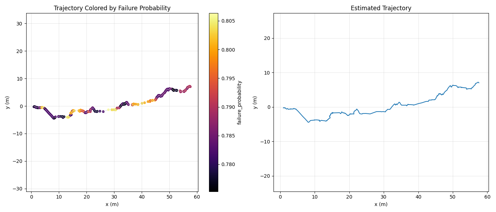
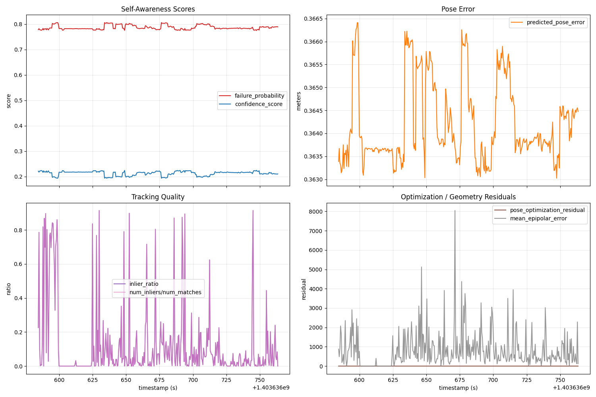
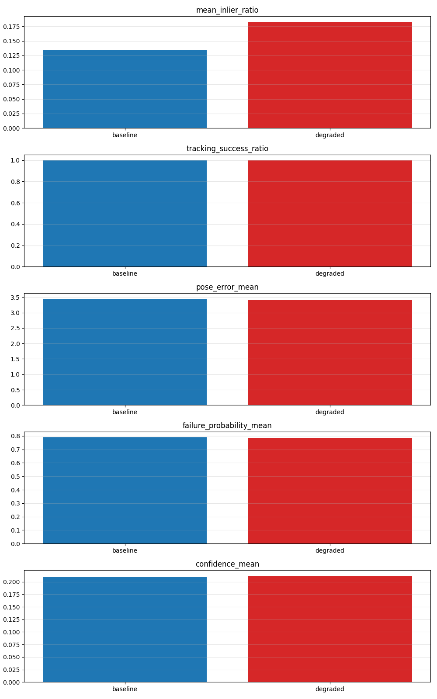
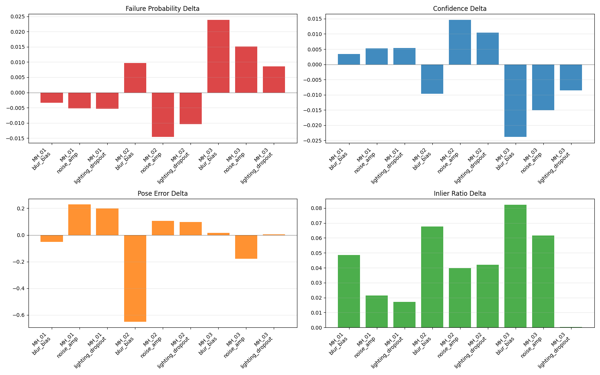

# Self-Aware VIO-SLAM

An end-to-end research systems project that combines a notebook-derived visual-inertial SLAM pipeline with a learned self-awareness module for localization reliability prediction.

The project turns internal SLAM signals into online and offline estimates of:

- `failure_probability`
- `confidence_score`
- `predicted_pose_error`
- `predicted_localization_reliability`

## What Is In This Repository

- `VIO-SLAM/`
  Main visual-inertial SLAM runtime. It reads EuRoC `mav0`, runs IMU preintegration + sliding-window optimization, and exports `slam_metrics.csv` and trajectories.
- `self_aware_slam/`
  Reliability prediction module. It performs feature engineering, temporal-window inference, and streaming/online prediction.
- `integration/`
  Bridge scripts for offline evaluation, online demo generation, batch runs, and visualization.

## System Overview

```text
EuRoC mav0
  -> VIO-SLAM/run_pipeline.py
  -> slam_metrics.csv + estimated_tum.txt
  -> self_aware_slam inference
  -> confidence / failure probability / predicted error
  -> analysis + GUI demo
```

## Main Capabilities

- Offline unified pipeline from SLAM output to self-aware prediction
- Online predictor sidecar attached to the VIO loop
- CSV export of internal tracking and optimization metrics
- Interactive local GUI demo for trajectory risk playback
- EuRoC playback with controllable camera / IMU degradation injection
- Baseline-vs-degraded comparison GUI for self-awareness stress testing
- Multi-sequence degradation sweep with composite scenarios, severity grids, benchmark tables, and interactive HTML report
- Model validity benchmark with correlation, ROC, calibration, and heuristic comparisons
- Packaging of unified runs into reusable training-ready sequences

## Demo Screenshots

Trajectory colored by online failure probability:



Interactive dashboard source view:



Baseline-vs-degraded playback comparison:





## Quick Start

Run the main VIO pipeline:

```bash
cd VIO-SLAM
./.venv/bin/python run_pipeline.py \
  --output ../outputs/mh01
```

Run the offline self-aware bridge:

```bash
cd ..
self_aware_slam/venv/bin/python integration/run_offline_unified_demo.py \
  --metrics outputs/mh01/slam_metrics.csv \
  --estimated outputs/mh01/estimated_tum.txt \
  --groundtruth VIO-SLAM/data/mav0/state_groundtruth_estimate0/data.csv \
  --output-dir outputs/mh01_self_aware \
  --config self_aware_slam/configs/config.yaml
```

Run the online version:

```bash
cd VIO-SLAM
./.venv/bin/python run_pipeline.py \
  --output ../outputs/mh01_online \
  --enable_online_self_aware
```

Generate the local interactive GUI demo:

```bash
cd ..
self_aware_slam/venv/bin/python integration/create_visual_demo.py \
  --metrics outputs/mh01_online/slam_metrics.csv \
  --predictions outputs/mh01_online/online_predictions.csv \
  --estimated outputs/mh01_online/estimated_tum.txt \
  --output-dir outputs/mh01_online_gui
```

Then open:

```text
outputs/mh01_online_gui/visual_demo.html
```

Run EuRoC playback with degradation injection and generate the comparison GUI:

```bash
self_aware_slam/venv/bin/python integration/run_euroc_degradation_demo.py \
  --data-path VIO-SLAM/data/mav0 \
  --camera-degradation motion_blur \
  --imu-degradation bias_drift \
  --severity 0.6 \
  --downsample 120 \
  --output-root outputs/euroc_degradation_quick
```

Then open:

```text
outputs/euroc_degradation_quick/comparison/gui/visual_demo.html
```

Run a representative multi-sequence sweep across five EuRoC Machine Hall sequences:

```bash
self_aware_slam/venv/bin/python integration/run_multisequence_degradation_sweep.py \
  --dataset-root VIO-SLAM/data/sequences \
  --sequences MH_01_easy,MH_02_easy,MH_03_medium,MH_04_difficult,MH_05_difficult \
  --scenarios blur_bias,noise_amp,lighting_dropout,dropout_bias \
  --severity-grid 0.45,0.70 \
  --output-root outputs/multisequence_degradation_grid
```

Then open:

```text
outputs/multisequence_degradation_grid/report/visual_demo.html
```

The aggregate report also writes stable benchmark tables:

- `outputs/multisequence_degradation_grid/report/benchmark_runs.csv`
- `outputs/multisequence_degradation_grid/report/benchmark_scenario_severity.csv`
- `outputs/multisequence_degradation_grid/report/benchmark_failure_delta_pivot.csv`
- `outputs/multisequence_degradation_grid/report/benchmark_failure_delta_pivot.md`

Validate whether the learned predictor is actually aligned with real pose error:

```bash
self_aware_slam/venv/bin/python integration/run_model_validity_benchmark.py \
  --sweep-results outputs/multisequence_degradation_grid/sweep_results.csv \
  --output-dir outputs/multisequence_degradation_grid/model_validity \
  --failure-thresholds 0.3,1.0,3.0 \
  --summary-threshold 3.0
```

This produces:

- `outputs/multisequence_degradation_grid/model_validity/validity_summary.txt`
- `outputs/multisequence_degradation_grid/model_validity/threshold_metrics.csv`
- `outputs/multisequence_degradation_grid/model_validity/run_level_correlations.csv`
- `outputs/multisequence_degradation_grid/model_validity/sequence_validity_summary.csv`
- `outputs/multisequence_degradation_grid/model_validity/scenario_validity_summary.csv`

## Documentation

The original Chinese documentation is intentionally kept unchanged for internal use:

- [README_运行指南.md](README_运行指南.md)
- [README_教学指南.md](README_教学指南.md)
- [README_自感知模型详解.md](README_自感知模型详解.md)
- [README_交付版.md](README_交付版.md)

## Current Scope

- The main SLAM runtime is a notebook-derived Python VIO pipeline, not a full C++ ORB-SLAM3 codebase
- The self-aware model is integrated and runnable, but still has domain-shift limitations
- The current repository is optimized for a strong research prototype / portfolio project rather than production deployment
