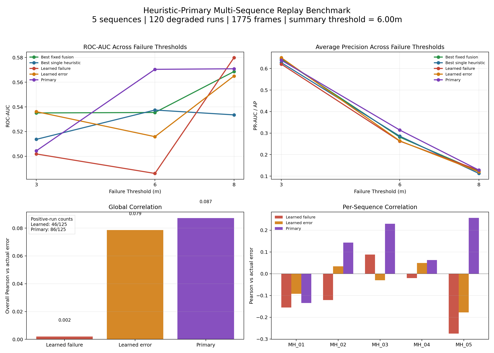

# Self-Aware VIO-SLAM

An end-to-end research prototype for **self-aware visual-inertial SLAM**.

This project combines:

- a notebook-derived Python VIO-SLAM runtime,
- internal SLAM metric export,
- offline and online reliability inference,
- degradation replay benchmarking,
- and interactive visualization for baseline-vs-degraded comparison.

The goal is not only to estimate pose, but also to estimate **how trustworthy the current localization state is**.

---

## 1. What This Project Does

The system turns internal SLAM signals into runtime risk estimates.

Current outputs include:

- `primary_risk_score`
- `primary_confidence_score`
- `learned_failure_probability`
- `learned_predicted_pose_error`
- `predicted_localization_reliability`

At the current stage, the shipped runtime path is:

- **heuristic-primary**
- **learned-auxiliary**

That means the user-facing runtime score is currently a heuristic-based primary signal, while learned outputs are retained for analysis and future research.

---

## 2. End-to-End Pipeline

The full pipeline is:

```text
EuRoC mav0
  -> VIO-SLAM/run_pipeline.py
  -> slam_metrics.csv + estimated_tum.txt
  -> integration/run_offline_unified_demo.py
  -> pose_errors.csv + reliability_predictions.csv
  -> benchmark / analysis / GUI / dataset building
```

More concretely:

1. **VIO-SLAM runtime**
   - reads EuRoC `mav0`
   - runs the Python visual-inertial sliding-window pipeline
   - exports trajectories and internal metrics

2. **Offline self-awareness bridge**
   - aligns estimated trajectory with ground truth
   - computes pose error
   - runs self-aware inference

3. **Runtime / benchmark layer**
   - generates `primary_*` and `learned_*` outputs
   - builds replay benchmarks
   - compares baseline vs degraded runs
   - produces sequence-level and frame-level evaluation summaries

---

## 3. Repository Layout

```text
ossa/
├── VIO-SLAM/
├── self_aware_slam/
├── integration/
├── outputs/
└── docs/assets/
```

### `VIO-SLAM/`
Main Python VIO-SLAM runtime.

Key files:

- `VIO-SLAM/run_pipeline.py`
- `VIO-SLAM/vio_pipeline.py`

### `self_aware_slam/`
Reliability inference, dataset building, training, and runtime scoring.

Key files:

- `self_aware_slam/src/models/inference.py`
- `self_aware_slam/src/data/dataset_builder.py`
- `self_aware_slam/src/models/train.py`

### `integration/`
Bridging scripts for replay, analysis, visualization, and benchmarking.

Key files:

- `integration/run_offline_unified_demo.py`
- `integration/create_visual_demo.py`
- `integration/run_multisequence_degradation_sweep.py`
- `integration/run_model_validity_benchmark.py`

---

## 4. How To Use

### 4.1 Run the main VIO pipeline

```bash
cd VIO-SLAM
./.venv/bin/python run_pipeline.py \
  --data_path /path/to/EuRoC/MH_01_easy/mav0 \
  --output ../outputs/mh01
```

Key outputs:

- `slam_metrics.csv`
- `estimated_tum.txt`
- `trajectory.txt`
- `trajectory.pkl`

### 4.2 Run offline self-awareness inference

```bash
cd ..
self_aware_slam/venv/bin/python integration/run_offline_unified_demo.py \
  --metrics outputs/mh01/slam_metrics.csv \
  --estimated outputs/mh01/estimated_tum.txt \
  --groundtruth /path/to/EuRoC/MH_01_easy/mav0/state_groundtruth_estimate0/data.csv \
  --output-dir outputs/mh01_self_aware \
  --config self_aware_slam/configs/config.yaml
```

Key outputs:

- `pose_errors.csv`
- `reliability_predictions.csv`
- `summary.txt`

### 4.3 Generate the local GUI

```bash
self_aware_slam/venv/bin/python integration/create_visual_demo.py \
  --metrics outputs/mh01_self_aware/slam_metrics.csv \
  --predictions outputs/mh01_self_aware/reliability_predictions.csv \
  --estimated outputs/mh01_self_aware/estimated.txt \
  --output-dir outputs/mh01_gui
```

Open:

```text
outputs/mh01_gui/visual_demo.html
```

### 4.4 Run a multi-sequence degradation replay sweep

```bash
self_aware_slam/venv/bin/python integration/run_multisequence_degradation_sweep.py \
  --dataset-root VIO-SLAM/data/sequences \
  --sequences MH_01_easy,MH_02_easy,MH_03_medium,MH_04_difficult,MH_05_difficult \
  --scenarios blur_bias,noise_amp,lighting_dropout,dropout_bias \
  --severity-grid 0.45,0.70 \
  --output-root outputs/multisequence_degradation_grid
```

Key outputs:

- `outputs/multisequence_degradation_grid/sweep_results.csv`
- `outputs/multisequence_degradation_grid/report/multi_sequence_summary.txt`
- `outputs/multisequence_degradation_grid/report/visual_demo.html`

### 4.5 Run the validity benchmark

```bash
self_aware_slam/venv/bin/python integration/run_model_validity_benchmark.py \
  --sweep-results outputs/multisequence_degradation_aligned_seedgrid/sweep_results.csv \
  --output-dir outputs/multisequence_degradation_aligned_seedgrid/model_validity_primary \
  --failure-thresholds 3.0,6.0,8.0 \
  --summary-threshold 6.0
```

Key outputs:

- `validity_summary.txt`
- `threshold_metrics.csv`
- `sequence_validity_summary.csv`
- `run_level_correlations.csv`

---

## 5. Current Results

### 5.1 Diagnostic learned-task results

Under the earlier strict held-out percentile task on the mixed diagnostic dataset:

- `P80`: `ROC-AUC = 0.798`, `PR-AUC = 0.739`
- `P85`: `ROC-AUC = 0.835`, `PR-AUC = 0.759`
- `P90`: `ROC-AUC = 0.864`, `PR-AUC = 0.747`

These results showed that short-horizon failure discrimination was learnable in a diagnostic setting.

However, these should **not** be treated as the final trustworthy model result.

### 5.2 Aligned full-pipeline result

After feature-semantics alignment and stricter replay evaluation, the current practical runtime result is:

- benchmark scope:
  - `5` sequences
  - `120` degraded runs
  - `1775` frame-level samples

At the representative `6.0m` frame-level failure threshold:

- `primary_failure_probability_roc_auc = 0.570`
- `primary_failure_probability_ap = 0.314`
- `learned_failure_probability_roc_auc = 0.486`
- `learned_predicted_pose_error_roc_auc = 0.516`
- `best_single_heuristic_roc_auc = 0.537`

Interpretation:

- the shipped **primary runtime score** is stronger than the learned failure head,
- it is also slightly stronger than the best single heuristic on the larger replay benchmark,
- but the overall result is still **moderate**, not strong enough to claim robust predictive validity.

---

## 6. Main Findings

The current repository supports four defensible conclusions:

1. **The full self-aware pipeline works end to end.**
   VIO runtime, metric export, offline reliability inference, degradation replay, GUI generation, and benchmark analysis are all integrated into one reproducible workflow.

2. **Mixed diagnostic datasets can make the learned task look easier than it really is.**
   Earlier percentile-based results showed promising learnability, but those results did not survive stricter feature-aligned replay evaluation.

3. **Feature semantics and evaluation protocol matter as much as model architecture.**
   The project explicitly checked sequence-held-out splitting, label construction, lead-time behavior, runtime-vs-train feature alignment, and heuristic-vs-learned head-to-head comparisons.

4. **The currently deployable runtime path is heuristic-primary.**
   Learned outputs remain useful as auxiliary signals and research artifacts, but they are not yet strong enough to replace the primary runtime score.

---

## 7. Limitations

This repository does **not** claim that learned failure prediction is solved.

Current limitations are:

- learned heads are weaker than the deployed primary score on the aligned replay benchmark,
- runtime validity is moderate rather than strong,
- lead-time evidence is limited, so strong early-warning claims are not justified,
- the current system is a research prototype, not a production SLAM stack.

---

## 8. Current Takeaway

The strongest defensible summary is:

> This repository is a research-grade self-aware VIO-SLAM prototype with a full replay-and-benchmark stack. The current deployable runtime design is heuristic-primary, while learned outputs remain auxiliary signals for analysis and future model development.

In short:

- the system works end to end,
- the evaluation stack is strict and reproducible,
- the learned story is not yet fully validated,
- the current runtime path is **practical and conservative** rather than overclaimed.

---

## 9. Benchmark Figure

Current one-page summary figure:



---

## 10. Reproducibility Notes

- EuRoC data is expected to live outside the repository and is not bundled here.
- Large training artifacts, local packaged datasets, and private/internal notes are intentionally excluded from the public GitHub repository.
- The public repository is meant to expose the **pipeline, code, benchmark logic, and current conclusions**, not every local experimental byproduct.

---

## 11. Status

Current repository status:

- runtime delivery path: **heuristic-primary**
- learned path: **auxiliary / diagnostic**
- benchmark status: **moderate runtime validity, not strong predictive validity**
- research status: **prototype complete, model story still open**

---

## 12. Note

This repository is structured as a research prototype rather than a production C++ SLAM stack.

The main value of the project is:

- full end-to-end self-awareness integration,
- reproducible replay evaluation,
- runtime risk visualization,
- and careful separation between diagnostic learned results and currently defensible deployable behavior.
