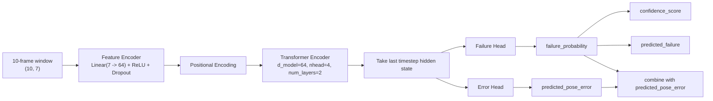

# Self-Aware 模型详解

这份文档只讲一件事：

**把当前 `self_aware_slam` 里的预测模型彻底讲清楚。**

如果你现在已经知道整条系统链路是：

```text
VIO-SLAM -> slam_metrics.csv -> self-aware predictor -> failure/confidence/error
```

但还不清楚：

- 模型到底是什么
- 输入到底是什么
- 为什么要用时间窗
- 为什么选 Transformer
- 输出的每个分数是什么意思
- 在线版是怎么接进主循环的

那就看这份文档。

---

## 1. 先说结论

你当前实际在用的 self-aware 模型是：

- **PyTorch Transformer 时序模型**
- checkpoint：
  `self_aware_slam/results/models/transformer_failure_predictor.pt`
- 输入：
  **最近 10 帧的 7 维 SLAM 内部特征**
- 直接输出：
  - `failure_probability`
  - `predicted_pose_error`
- 派生输出：
  - `confidence_score = 1 - failure_probability`
  - `predicted_localization_reliability = (1 - p) / (1 + error)`
  - `predicted_failure = p >= 0.5`

当前配置在：

```text
self_aware_slam/configs/config.yaml
```

核心配置是：

- `model.type = transformer`
- `window_size = 10`
- `n_features = 7`
- `d_model = 64`
- `nhead = 4`
- `num_layers = 2`

当前模型参数量大约是：

- **104,706**

但这里要区分两件事：

- **当前 runtime predictor**
  - 还是这套 `7` 维输入的 Transformer checkpoint
  - 用于 online/offline demo
- **新的 v2 训练路径**
  - 已经改成 `22` 维 trend-aware learning features
  - target 也统一成 future-based 定义
  - 目的是修正旧任务定义“会反应但不够可学”的问题

---

## 2. 这个模型要解决什么问题

这个模型不是做普通分类，也不是直接做视觉识别。

它要解决的问题是：

> 只看 SLAM 自己内部的运行状态，判断“当前定位是不是正在变得不可靠”。

也就是说，它做的不是：

- 输入一张图，输出类别

而是：

- 输入一小段时间内的 SLAM 内部指标
- 输出当前失败概率和定位误差预测

所以它更像一个：

**系统健康状态预测器**

而不是传统视觉网络。

---

## 3. 模型的输入到底是什么

### 3.1 不是图像

这个模型**不直接吃原始图像**。

图像和 IMU 先进入主 VIO-SLAM，主系统会导出一系列内部 metrics，例如：

- `num_matches`
- `num_inliers`
- `inlier_ratio`
- `pose_optimization_residual`
- `trajectory_increment_norm`
- `imu_delta_translation`

这些原始工程指标再被整理成模型真正吃的 **7 个 canonical features**。

### 3.2 当前 runtime 的 7 个 canonical features

当前模型使用的 7 个特征是：

1. `feature_count`
2. `feature_tracking_ratio`
3. `reprojection_error_mean`
4. `reprojection_error_std`
5. `imu_residual_norm`
6. `camera_motion_magnitude`
7. `tracking_length`

你可以把它们理解成 3 类信息：

- **视觉质量**
  - `feature_count`
  - `feature_tracking_ratio`
  - `reprojection_error_mean`
  - `reprojection_error_std`
- **惯导/优化一致性**
  - `imu_residual_norm`
- **运动与稳定性**
  - `camera_motion_magnitude`
  - `tracking_length`

### 3.3 为什么这些特征有用

- `feature_count`
  - 特征太少，视觉约束往往不够
- `feature_tracking_ratio`
  - 跟踪成功比例下降，通常意味着前端不稳
- `reprojection_error_mean/std`
  - 几何一致性变差时会升高
- `imu_residual_norm`
  - 惯导约束异常时会变大
- `camera_motion_magnitude`
  - 快速运动通常更容易导致 blur 和匹配退化
- `tracking_length`
  - 长期稳定跟踪突然变短，通常是退化信号

---

## 4. 原始 SLAM 指标怎么映射成这 7 个特征

这层逻辑在：

```text
self_aware_slam/src/data/feature_engineering.py
```

当前不是要求主 VIO 一定原生输出这 7 列，而是支持 **alias 映射**。

例如：

- `feature_count`
  - 可以来自 `feature_count` / `num_matches` / `num_keypoints`
- `feature_tracking_ratio`
  - 可以来自 `feature_tracking_ratio` / `inlier_ratio`
- `reprojection_error_mean`
  - 可以来自 `reprojection_error_mean` / `pose_optimization_residual`
- `camera_motion_magnitude`
  - 可以来自 `camera_motion_magnitude` / `trajectory_increment_norm` / `imu_delta_translation`

这一步很重要，因为它解决了一个工程现实问题：

> 主 VIO 的指标命名，和 self-aware 训练时代码使用的字段命名，并不是天然一致的。

所以当前项目能跑通，不是因为两个工程天生兼容，而是因为做了这一层特征桥接。

### 4.1 v2 为什么不再只用这 7 个特征

当前 runtime 的 7 个特征更偏：

- 当前状态诊断
- 同步质量监控

但如果目标是预测“接下来会不会坏、接下来最坏会坏到什么程度”，光靠同步量不够。

所以 v2 训练路径新增了 15 个趋势特征，重点补的是：

- `delta_*`
- `rolling_mean_*`
- `rolling_std_*`
- `slope_*`

现在 v2 训练总维度是：

- `22` 维

它不是为了让 online demo 更复杂，而是为了让训练任务本身更可学。

### 4.2 v2 当前 target 是什么

v2 不再混用 current failure 和 predictive failure。

当前统一成：

- regression target:
  `future_max_pose_error` over next `10` frames
- classification target:
  `future_max_pose_error > 0.18m` or future tracking lost

这比旧版更干净，因为：

- train / val / test 语义一致
- regression / classification 围绕同一个 future target
- 不再出现 train 学当前失败、eval 看未来失败的错位

当前 v2 数据集不再只来自 `slam_metrics_dataset/MH_*` 这种 baseline 序列。

现在默认优先使用：

- 长 baseline sequence dirs
- 多序列 degradation sweep 生成的 degraded replay runs

如果两者都存在，就走 `hybrid`；如果缺 replay runs，就回退到 `sequence_dirs`；如果只有 replay runs，就走 `sweep_runs`。

对 degraded replay runs，当前不再做简单 run-level shuffle，而是按
`(sequence, base_scenario)` 作为 **replay family** 做 split，避免同一 replay family 同时出现在 train 和 test。

builder 还会显式打印：

- 当前选中的 data source
- 找到多少 replay runs
- 是否触发 fallback

当前 builder 支持两套 split protocol：

- `family_aware_dev`
  - 默认值
  - 适合开发阶段验证 learnability
  - degraded runs 按 replay family 切分
- `sequence_held_out`
  - 严格跨 sequence benchmark
  - 同一个 sequence 的 baseline + degraded 全部进入同一个 split

当前默认 `prediction_horizon = 5`，所以 `MH_04_difficult` / `MH_05_difficult` 的公开 degraded replay runs 已经可以被保留。

这意味着 `sequence_held_out` 现在不只是 protocol 正确，而且 val/test 里也已经有可用的 hard-sequence degraded 样本。

这样做的目的很直接：

- 让 train 真正看到 failure
- 让 val/test 也保留 baseline + degraded 的混合分布
- 避免旧版那种 “train 太干净、test 太难” 的结构性问题

### 4.3 v2 checkpoint 现在也能走统一推理入口

现在 `src/models/inference.py` 已经同时支持两类 checkpoint：

- 旧版 runtime checkpoint（7 维输入）
- v2 checkpoint（22 维 trend-aware learning features）

区别不靠手工改代码，而是靠：

- `--checkpoint`
- `--dataset-stats`

这两个参数显式指定。

也就是说，后面你训练出新的 v2 模型后，可以直接把它接到：

- `run_offline_unified_demo.py`
- `run_multisequence_degradation_sweep.py`
- `run_model_validity_benchmark.py` 的上游输出链

不需要再单独维护一套新的推理脚本。

---

## 5. 为什么不是单帧预测，而是时间窗

当前窗口大小是：

- `window_size = 10`

也就是说，模型真正看到的输入不是一帧，而是：

```text
(10, 7)
```

也就是：

- 10 个连续时刻
- 每个时刻 7 个特征

### 为什么一定要时间窗

因为 SLAM 的失效通常不是瞬间发生的，而是逐渐恶化：

- 内点率持续下降
- 残差持续升高
- 运动越来越激烈
- tracking length 越来越短

如果只看单帧，很可能看不到趋势。

而时间窗能回答的问题是：

> 最近这一小段时间，系统状态是在变好，还是在变坏？

这也是 self-awareness 的核心价值。

---

## 6. 为什么当前选 Transformer

这个项目里其实定义了 3 个模型：

1. `FailureMLP`
2. `FailureLSTM`
3. `FailureTransformer`

但当前运行时选的是：

- `FailureTransformer`

### 6.1 MLP 的特点

MLP 会把整个窗口展平后直接做全连接。

优点：

- 结构简单
- 训练容易

问题：

- 对时序关系利用弱
- 更像“把 10 帧当成一个大向量”

### 6.2 LSTM 的特点

LSTM 可以建模顺序信息。

优点：

- 天然适合时间序列

问题：

- 表达力有限
- 不容易像 attention 那样强调关键时间点

### 6.3 Transformer 的特点

Transformer 的优势在这里是：

- 可以在一个短时间窗里关注关键异常点
- 能学习多个特征之间的联动变化
- 更适合做“状态趋势判断”

你可以把它理解成：

> 不是只问“这一帧危险吗”，而是问“最近一段系统状态里，哪些时刻最说明它在失稳”。

---

## 7. 当前 Transformer 结构长什么样

可以看成这条链：



更具体一点：

### 7.1 Feature Encoder

每个时间步的 7 维特征先经过：

- `Linear(7 -> 64)`
- `ReLU`
- `Dropout`

作用：

- 把原始表格特征投影到统一 hidden space

### 7.2 Positional Encoding

因为 Transformer 本身不带时序顺序感，所以这里加了：

- `sin/cos positional encoding`

作用：

- 告诉模型“第 1 帧”和“第 10 帧”不是同一个位置

### 7.3 Transformer Encoder

当前配置：

- `d_model = 64`
- `nhead = 4`
- `num_layers = 2`

作用：

- 在一个 10 帧窗口里建模特征之间的时序依赖

### 7.4 双头输出

最后取 **最后一个时间步** 的 hidden state，然后接两个 head：

- `failure_head`
- `error_head`

分别输出：

- `failure_probability`
- `predicted_pose_error`

---

## 8. 这个模型的输出到底是什么意思

### 8.1 直接输出

模型直接输出 2 个值：

1. `failure_probability`
   - 一个 `0~1` 之间的概率
   - 越高表示越可能失败

2. `predicted_pose_error`
   - 预测的位姿误差大小
   - 当前实现里通过 `ReLU` 保证非负

### 8.2 派生输出

推理脚本进一步计算：

#### `confidence_score`

```text
confidence_score = 1 - failure_probability
```

#### `predicted_failure`

```text
predicted_failure = failure_probability >= 0.5
```

#### `predicted_localization_reliability`

```text
predicted_localization_reliability = (1 - failure_probability) / (1 + predicted_pose_error)
```

这个值不是模型直接学出来的，而是工程上定义的组合指标。

它的直觉是：

- failure probability 越低越好
- predicted pose error 越小越好

---

## 9. 训练时这个模型怎么学

训练入口在：

```text
self_aware_slam/src/models/train.py
```

训练时用了一个联合损失：

- `BCELoss` 负责 failure classification
- `MSELoss` 负责 pose error regression

总损失形式是：

```text
loss = BCE + 0.5 * MSE
```

所以这个模型不是纯二分类，也不是纯回归，而是：

**一个联合学习的 failure + error predictor**

---

## 10. 推理时这套模型怎么跑

推理入口在：

```text
self_aware_slam/src/models/inference.py
```

它有两种模式。

### 10.1 离线推理

离线模式流程是：

1. 读 `slam_metrics.csv`
2. 做 alias 映射
3. 做 normalization
4. 切成 `(N, 10, 7)` 窗口
5. 批量送进 Transformer
6. 保存 `reliability_predictions.csv`

### 10.2 在线推理

在线模式里有一个：

- `OnlinePredictorRuntime`

它会：

1. 常驻加载模型
2. 接收主 VIO 每个滑窗输出的一行 metrics
3. 放进 buffer
4. 当 buffer >= 10 时开始预测
5. 返回一条当前风险结果

所以在线版不是每次重新加载模型，而是：

**长驻 sidecar + 流式窗口推理**

---

## 11. 这套模型和主 VIO 是怎么接上的

主 VIO 在每个滑窗都会产生一条 metrics record。

然后：

```text
VIO metrics row
  -> OnlinePredictorRuntime.process_row()
  -> append to temporal buffer
  -> if len(buffer) >= 10:
         run transformer
         return prediction
```

这就是为什么在线版会有一个很自然的“预热期”：

- 前 9 帧没有完整时间窗
- 到第 10 帧开始才会稳定产出预测

---

## 12. 这套模型的强项和局限

### 强项

1. **不是只看单个 heuristic**
   - 比如不只是盯着 reprojection error 阈值

2. **能看退化趋势**
   - 这是时间窗 + Transformer 的价值

3. **和主 SLAM 解耦**
   - 不直接改动主估计器
   - 工程上更稳

4. **同时输出 failure 和 error**
   - 更适合系统展示和后续决策

### 局限

1. **不是端到端视觉模型**
   - 它看不到原始图像语义
   - 只能通过内部指标间接感知退化

2. **依赖特征工程**
   - 如果特征选得差，模型上限也会被限制

3. **有 domain shift**
   - 当前模型是在既有数据分布上训练的
   - 接到当前主 VIO 后，结果能跑，但不代表已经 fully calibrated

4. **当前 reliability 公式是工程定义**
   - 不是模型直接学出来的标准不确定性

---

## 13. 你面试时应该怎么讲这个模型

### 30 秒版本

> 我当前的 self-aware 模块是一个 PyTorch Transformer 时序模型。它不直接吃图像，而是读取最近 10 帧 SLAM 内部特征，比如内点率、残差和运动量，预测 failure probability 和 pose error，再进一步计算 confidence 和 localization reliability。

### 2 分钟版本

> 我没有把 self-awareness 做成一个直接吃图像的黑盒模型，而是让它读取 SLAM 自己的内部运行状态。主 VIO 每个滑窗会导出一行 metrics，我把这些指标映射成 7 个 canonical features，再用最近 10 帧构成时序窗口，送进一个 PyTorch Transformer。模型输出 failure probability 和 predicted pose error，之后再组合成 confidence score 和 localization reliability。这样做的好处是它能学习系统状态是如何逐渐恶化的，而不是只依赖某个阈值规则。

### 如果面试官追问“为什么不用阈值”

你可以答：

> 阈值方法通常只看单一指标，比如 reprojection error 或 tracking ratio，而且规则固定。我的做法是让模型同时看多个内部信号，并用时间窗建模趋势，因此它更接近“系统状态判断”，而不是单一 heuristic。

---

## 14. 你接下来最值得继续学什么

如果你想把这部分真正讲透，建议按这个顺序复习：

1. **先看特征工程**
   - `self_aware_slam/src/data/feature_engineering.py`

2. **再看模型结构**
   - `self_aware_slam/src/models/failure_predictor.py`

3. **再看推理入口**
   - `self_aware_slam/src/models/inference.py`

4. **最后看训练脚本**
   - `self_aware_slam/src/models/train.py`

你真正要做到的不是背代码，而是能清楚回答这 4 个问题：

1. 模型吃什么？
2. 为什么要用时间窗？
3. 为什么当前选 Transformer？
4. 输出分数各自是什么意思？

只要这 4 个问题你能顺着讲清楚，这套 self-aware 模型你就已经掌握到足够面试和汇报的程度了。
